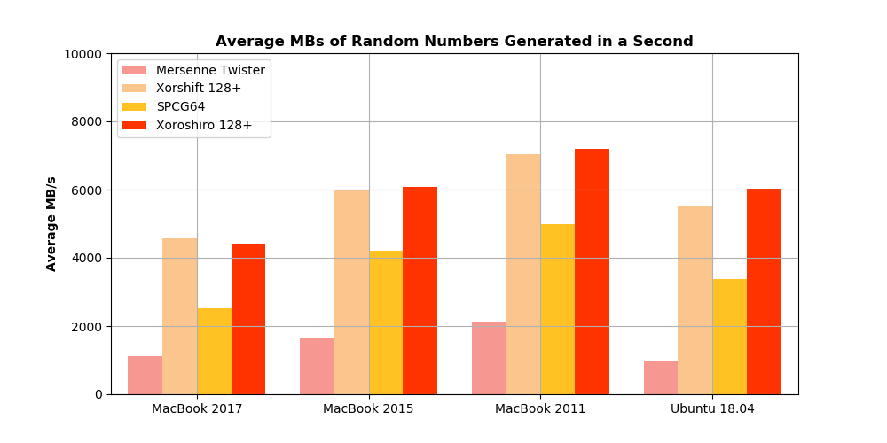

# Testing PRNGS Across Different Architectures
This blog explores the performance of different Pseudo Random Number Generators (PRNGs) across different architectures. It was inspired by a project in our architecture class, and we wanted to post it for anyone else who might be interested in doing this. In this blog we look at 4 different PRNGs (Mersenne Twister, Xorshift 128+, SPCG 64, and Xoroshiro 128+) and test both their speed and statistical correctness on 4 different architectures (MacBook Pro 2011, MacBook Pro 2015, MacBook 2017, and Ubuntu 18.04). These are the four personal machines that we had at our disposal. We wanted to see if there were any huge differences in performance between them, especially with 3 of them being so similar and take a deeper dive into why this might be the case. We will be using two tools (shootout and dieharder) to help us test speed and accuracy of these PRNGs. 

## Problem and Motivation
Although we focused on pseudo-random number generators (PRNGs), these are not the only tools available for generating random numbers. Hardware random number generators (HRNGs), also known as true random number generators (TRNGs), are hardware that exploit quantum phenomena. These phenomena, in theory, provide true randomness and, as a result, TRNGs are most widely-used in encryption protocols. However, due to incompleteness, we are unable to prove that TRNGs generate truly random numbers. That being said, we cannot prove that TRNGs do not generate truly random numbers, whereas, we have proven that PRNGs don’t generate truly random numbers. Now you may ask, why do we use PRNGs at all (instead of just using TRNGs)? The answer is comprised of many different reasons. TRNGs are slower than PRNGs. For example, in cryptography applications, they often generate a seed to feed to a PRNG as a way to leverage “some randomness” while also meeting time requirements. TRNGs also degrade immeasurably (due to their construction), and this degradation results in a loss of randomness. Degradation will also amplify any existing bias in the TRNG - bias often results in non-normal distributions of numbers generated. Note: PRNGs are implemented in software, while TRNGs are implemented in hardware. TRNGs cannot be implemented as software due to the definition of a Turing machine.

Pseudo-random number generation process takes an important role in a wide range of algorithms and  applications. Here are some examples of these applications.
* Simulations (Modeling)
* Cryptography (Key Generation)
* Games (Procedural Generation)
* Lotteries

This makes it hard to decide on which PRNG to use for a certain application. There are two primary factors that affect the selection of a PRNG. The first factor is the speed of a generator, and the second factor is the quality of the numbers generated. There are a number of statistical properties considered for any sequence of random numbers generated by a RNG which may negatively affect the algorithm using it. For example, outputted bits should appear to be independent and follow the desired distribution.

Most of the RNG test suites concentrate on the quality of the random numbers generated while ignoring the time spent on the generation process. However, this often-overlooked aspect may significantly affect application performance. 

## Experimental Setup

### PRNGs Tested

#### Mersenne Twister
The Mersenne Twister (MT) algorithm was first introduced in a 1998 paper entitled "Mersenne Twister: A 623-Dimensionally Equidistributed Uniform Pseudo-Random Number Generator" by Makoto Matsumoto and Takuji Nishimura. MT made many improvements to older random number generators. Specifically, MT was a modified version of (T)GFSR or Twisted Generalized Feedback Shift Register; these algorithms are ultimately based on inductive algebra. MT increased number generation speed while also fulfilling some important properties that older algorithms failed. Its name refers to the period of the algorithm (how many iterations before it begins to repeat), 2^(19937) - 1, which is a Mersenne prime number. MT's major contributions were improvements to k-distribution, the characteristic polynomial, and the relatively long period compared to leading PRNGs at the time. Below is the comparison table provided in the original paper; the algorithms that are not MT are mostly variants of TGFSR. The "working area" row is a measure of the memory space each algorithm needs. 


#### Xorshift 128+ 
George Marsaglia published "Xorshift RNGs" in 2003 which introduced the class of xorshift PRNGs. His major improvement upon previous PRNGs was utilizing a non-sparse polynomial. Informally, this means that previous PRNGs would "skip" many potential numbers, which leads to predictability (non-normal distributions) and shorter periods. Xorshift 128+ was published in the paper "Further scramblings of Marsaglia’s xorshift generators" by Sebastiano Vigna in 2016. His major contribution was lengthening the period to 2^(128) - 1 which allowed the algorithm to pass more statistical tests than many other xorshift variants. Although xorshift128+ may still sometimes pass fewer statistical tests than MT, it was designed with speed as the first priority.

#### SPCG64
SPCG64 is a simplified variant of the Permuted Congruential Generator, published in 2016 by Melissa E. O'Neill. This generator was designed for limited memory capacity and somewhat limited computational power. It aims to produce "medium-quality" numbers very efficiently.

#### Xoroshiro 128+ 
Xoroshiro 128+ was a collaboration between David Blackman and Sebastiano Vigna intended to succeed xorshift 128+. They published "Scrambled Linear Pseudorandom Number Generators" in May 2018. It specifically aimed to maintain the high speed of the PRNG while strengthening some of its statistical weak spots. Particulary, they aimed to improve the results of the binary-rank and linear-complexity tests. They introduce two new linear transformations designed to be statistically sound in addition to proposing a new bias-detection technique. Fianlly, they strategically combine scramblers (non-linear transformations) with linear transformations to produce results that maintain (or improve) statistical integrity while improving speed.

### Architectures Tested

|    System    | Architecture |   # Cores  | Speed (GHz) |  Memory  | Memory speed (MHz) |
| ------------- | ------------- | ------------- | ------------- | ------------- | ------------- |
| Ubuntu 18.04  | Intel Core i7-2600 | 8  | 3.4  | 16 GB DDR3 | 1333 |
| Mac OS 2011 | Intel Core i7-2640M  | 2 | 2.8  | 4 GB DDR3 | 1333 |
| Mac OS 2015 | Intel Core i5-5257U  | 2 | 2.7  | 8 GB DDR3 | 1867 |
| Mac OS 2017 | Intel Core i5-7360U  | 2 | 2.3  | 8 GB LPDDR3 | 2133 |

We tested four distinct Intel Core architectures released between 2011 and 2017. Among our architectures, we have both a mobile and desktop version of the Sandy Bridge architecture. Sandy Bridge (first released Jan 2011) was the sucessor of the Nehalem microarchitecture released in 2008. There were many improvements incorporated including many cache optimizations as well as improvements to functional units for faster/more accurate output. It also implements two load/store operations for each memory channel per CPU cycle and a fourteeen- to nineteen-stage instruction pipeline. Based on this information, we expected the Ubuntu machine to outperform the 2011 Macbook.

Unfortunately, after scouring the web, we couldn't find any reliable information about transistor count or die size for the Kaby Lake architecture. Kaby Lake is the successor to the Skylake architecture (which also has 14 nm lithography) when it was announced that the 10 nm lithography Cannon Lake architecture release would be delayed. Kaby Lake is a physical artifact of Moore's Law (and the fact that it is losing relevancy) as it broke the Intel "tick-tock" design/release model which incorporated die size decrease as a central element of a new architecture, and instead introduced the new "process architecture optimization" design model. Note that our Kaby Lake 2017 Macbook is the only machine we tested that utilized low-power cores. Broadwell is the predecessor to Skylake and the sucessor of the Haswell architecture. Most of the improvements made in the Broadwell architecture are related to the details of the integrated GPU, particulary for data science.

| Architecture | Release | Lithography (nm) | # Transistors | Die size (mm^2) |
| ------------- | ------------- | ------------- | ------------- | ------------- |
| i7-2600 | Jan 2011, ~$300, Sandy Bridge (2nd generation) | 32 | 1.16 billion | 216 |
| i7-2640M | Sept 2011, ~$350, Sandy Bridge (2nd generation) | 32 | 624 million | 149 |
| i5-5257U | Jan 2015, ~$315, Broadwell-U (5th generation) | 14 | 1.3 - 1.9 billion | 82 - 133 |
| i5-7360U | Jan 2017, ~$300, Kaby Lake-U (7th generation) | 14 | ? | ? |

### Method

#### Test 1: Dieharder Statistical Tests
Dieharder is a random number generator (RNG) testing suite and it is intended to test any kind of random number generator. It is named in an omage to George Marsaglia who had what he called a "Diehard battery of tests" for random number generators. The tool is built on top of GSL's random number generator. This suite contains tests from the Statistical Test Suite (STS) developed by the National Institute for Standards and Technology (NIST). It also provides information not only that a test failed, but why it failed. It's purpose is to make it easy to test PRNGs. It prefers to use a continuos, "live" stream of random numbers being generated by a PRNG (this can be done by wrapping the PRNG in a GSL compatible interface), but it can also take a large file of at least 10 million random numbers generated by a PRNG. This suite has a total of 114 different tests to perform, and measures things such as uniformity, independence, long period, proper initialization, unpredictability, efficiency and portability. Some of the names of the tests may be familiar to you (Birthday spacings, Overlapping permutations, Monkey tests, Count the 1s, Ranks of matrices, Parking lot test, Minimum distance test, Random spheres test, The squeeze test, Overlapping sums test, Runs test).

#### Test 2: Shootout Timings
Our second test was run using a tool called shootout. It gives C implementations of all the PRNGs and the capacity to run each PRNG for one second and measure the amount of MB produced for each PRNG in that second. We then compare these to get one measure of speed. The tool can output more than the 4 PRNGs we chose. We ran this test 30 times for each PRNG on each architecture.

#### Test 3: Individual Timings
Our third tests were to do individual timings of each PRNG to produce 1,5, and 10 million random numbers. We ran this test 10 times for each architecture, for each PRNG. 

If you want to follow our experimental method exactly, go to Testing_Plan_README.txt in the repo and it will give you all the comands to run.

## Evaluation
### Dieharder Results
For our testing with dieharder, we created a file for each PRNG of 60 million numbers generated to use for testing. The dieharder tool was then run on these files and the results output to a text file. Below is a table summarizing our results.  The "Tests Weak" column represents tests that passed, but not to dieharder's specifications of complete passing. 

|     PRNGs     | Tests Passed  |   Tests Weak  | Tests Failed  |  Total Tests  |
| ------------- | ------------- | ------------- | ------------- | ------------- |
| Mersenne Twister  | 91  | 10  | 13 | 114  | 
| Xorshift 128+ | 95  | 5  | 14  | 114  |
| SPCG 64 | 95  | 7  | 12  | 114  |
| Xoroshiro 128+ | 89  | 15  | 10  | 114  |

We see some interesting things. First that while Xoroshiro has the least amount of failed tests, it has the least amount of completely passed tests and the most amount of weakly passed tests. Mersenne Twister has more completely passed tests, although it has more failed tests as well. 

### Timing Test 1: Shootout Results
In addition to the dieharder suite, we also used a tool "shootout" to test the speed of our chosen PRNGs. It was written by Chris Wellons and can be found here. This tool takes each PRNG and records the amount of random numbers generated in one second, measured in MB. We ran this tool 30 times on each architecture (Mac 2011, Mac 2015, Mac 2017, Ubuntu 18.04) and recorder the value for all four algorithms (Mersenne Twister, Xorshift 128+, SPCG 64, and Xoroshiro 128+). Our expectations are that, within each algorithm, we will see higher MBs generated per second for more recent algorithms. 

 




For the Mersenne Twister, Xorshift, and SPCG64 algorithms, we see this trend that the newer architectures generate more MB/s, with the three MacBooks. However, with the Ubuntu 18.04, we see a dip in the amount of random numbers generated across the board. We also see this trend is evident when just considering the averages.

To see the trend across the different algorithms, we need to look at all this data on the same scale. We expect that newer algorithms would generate more MB/s. In the image below, we see that Xorshift and Xoroshiro generate the most, between 4000-7000 MB/s. Mersenne Twister, generates the least (1000-2500 MB/s), as expected. However, although SPCG was developed after Xorshift, it actually generates less, only between 2000-5000 MB/s.


### Timing Test 2: Fixed Amount of Random Numbers Generated
The second part of our timing test, is to generate a fixed amount of random numbers, and time it for each algorithm, across the four architectures. For this, we did 3 different amounts of random numbers generated (1, 5, and 10 million) and ran 10 tests for each amount, for each algorithm, on each architecture (So 480 tests in total). Our expectation was that comparing across architectures, we will see faster times for the more recent machines.

  
  

We see that overall, this trend does appear. Within each algorithm, the MacBook 2011 is the slowest and Ubuntu 18.04 is the fastest. Between the MacBook 2015 and MacBook 2017, we see the MacBook 2017 has a wider range of values. So the majority of instances the MacBook 2015 is actually faster than the MacBook 2017, but there are cases where the reverse is true. 

We took the same data, and compared across the 4 different algorithms, to see what the difference in time was between algorithms. We expect, that the algorithms developed most recently will have faster times.

  
  

Across the different algorithms, the oldest, Mersenne Twister, is slower, but only by a few microsends. The other three are extremely similar. Interestingly, the MacBook 2015 and Ubuntu 18.04 have the least amount of variance. 

## Future Work/Challenges
We faced a few roadblocks during our experiment that inspired us with ideas for future work. For example, we tried to run the PRNGs on one of our team member's ECE/CIS accounts but due to permissions issues, we were unable to obtain results for that machine. We also attempted testing on an AMD machine one of our team members built, but the machine ended up having to be wiped after experimenting with generating over a billion numbers. Our team member with a windows machine was unable to properly build or run the test suites. Ideally, we'd love to look at results from a wider diversity of architectures (server machines, mobile phones, etc.). We unfortunately did not have time to experiement with the effect using a different compiler (like clang) would impact our results. There are also other test suites that may provide a different perspective, such as the R package, RDieharder.

## Conclusion
In conclusion, we found that the overall PRNG performances did match our expectations with the most recent PRNG producing the highest overall performance. Accordingly, we can arrange the chosen PRNG based on their performances in all three tests.

* 1. Xoroshiro 128+
* 2. SPCG 64
* 3. Xorshift 128+
* 4. Mersenne Twister

Xoroshiro128+ is clearly the fastest considering both speed tests, and it also has the fewest observed statistical failure tests compared to the others. We consider failure tests because they are more significant, while weak results are used only to break ties. Also, SPCG64 is considered the second best performance although Xorshift128+ exceeds its performance for the shootout test. This is because SPCG64 has less statistical failure tests compared to Xorshift 128+. Xorshift 128+ comes in third place although it has more statistical failure tests than Mersenne Twister. This is because we are also considering number-generation speed which shows that Xorshift 128+ has significantly higher performance results for both speed tests compared to Mersenne Twister.

## References
Our references


# Examples
## How to put in Image


## Subtitle
Some stuff
### Sub Subtitle
More stuff
#### Sub Sub Sub Title
```
Give an example
```
## This is how you do a list
* Item 1
* Item 2
* Item 3

This is how you do **bold** and this is how you do *italics*
[Web link](https://rachelkraft.github.io/ArchProjTeam1/)
