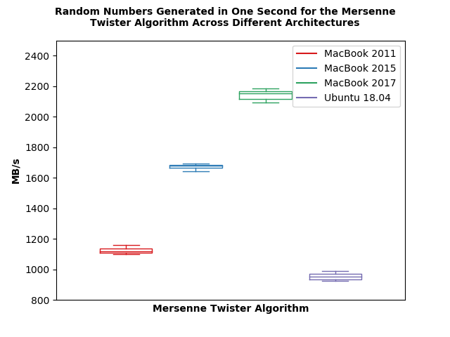
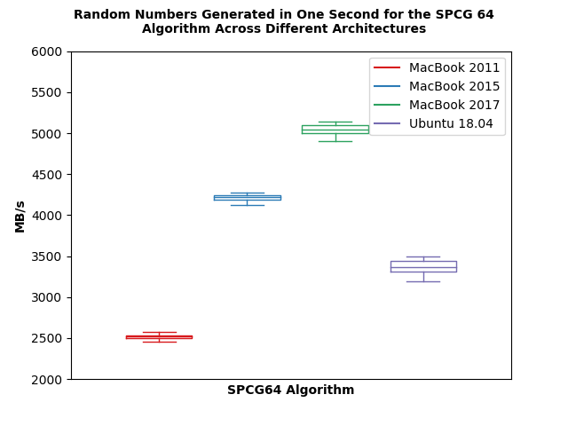

# Testing PRNGS Across Different Architectures
This blog explores the performance of different Pseudo Random Number Generators (PRNGs) across different architectures. It was inspired by a project in our architecture class, and we wanted to post it for anyone else who might be interested in doing this. In this blog we look at 4 different PRNGs (Mersenne Twister, Xorshift 128+, SPCG 64, and Xoroshiro 128+) and test both their speed and statistical correctness on 4 different architectures (MacBook Pro 2011, MacBook Pro 2015, MacBook 2017, and Ubuntu 18.04). These are the four personal machines that we had at our disposal. We wanted to see if there were any huge differences in performance between them, especially with 3 of them being so similar and take a deeper dive into why this might be the case. We will be using two tools (shootout and dieharder) to help us test speed and accuracy of these PRNGs. The rest of the blog is as follows:

Problem and Motivation
Literature Review
Our Solution
Experimental Setup
Evaluation
Disscussion/Results
Threats to Validity
Challenges and Future Work
References

## Problem and Motivation
Problem and Motivation text

## Literature Review
Lit Review text

## Our Solution
Solution text

## Experimental Setup
Experimental Setup text and table

## Evaluation
### Dieharder Results
For testing the correctness of our PRNGs, we used a suite called dieharder.

### Timing Test 1: Shootout Results
In addition to the dieharder suite, we also used a tool "shootout" to test the speed of our chosen PRNGs. It was written by Chris Wellons and can be found here. This tool takes each PRNG and records the amount of random numbers generated in one second, measured in MB. We ran this tool 30 times on each architecture (Mac 2011, Mac 2015, Mac 2017, Ubuntu 18.04) and recorder the value for all four algorithms (Mersenne Twister, Xorshift 128+, SPCG 64, and Xoroshiro 128+). Our expectations are that, within each algorithm, we will see higher MBs generated per second for more recent algorithms. 

 



For the Mersenne Twister, Xorshift, and SPCG64 algorithms, we see this trend that the newer architectures generate more MB/s, with the three MacBooks. However, with the Ubuntu 18.04, we see a dip in the amount of random numbers generated across the board. We also see this trend is evident when just considering the averages.

To see the trend across the different algorithms, we need to look at all this data on the same scale. We expect that newer algorithms would generate more MB/s. In the image below, we see that Xorshift and Xoroshiro generate the most, between 4000-7000 MB/s. Mersenne Twister, generates the least (1000-2500 MB/s), as expected. However, although SPCG was developed after Xorshift, it actually generates less, only between 2000-5000 MB/s.


### Timing Test 2: Fixed Amount of Random Numbers Generated
The second part of our timing test, is to generate a fixed amount of random numbers, and time it for each algorithm, across the four architectures. For this, we did 3 different amounts of random numbers generated (1, 5, and 10 million) and ran 10 tests for each amount, for each algorithm, on each architecture (So 480 tests in total). Our expectation was that comparing across architectures, we will see faster times for the more recent machines.

  
  

We see that overall, this trend does appear. Within each algorithm, the MacBook 2011 is the slowest and Ubuntu 18.04 is the fastest. Between the MacBook 2015 and MacBook 2017, we see the MacBook 2017 has a wider range of values. So the majority of instances the MacBook 2015 is actually faster than the MacBook 2017, but there are cases where the reverse is true. 

We took the same data, and compared across the 4 different algorithms, to see what the difference in time was between algorithms. We expect, that the algorithms developed most recently will have faster times.

  
  

Across the different algorithms, the oldest, Mersenne Twister, is slower across the board, but only by a few microsends. The other three are extremely similar. Interestingly, the MacBook 2015 and Ubuntu 18.04 have the least amount of variance. 

## Discussion/Results
Our discussion of the graphs and results

## Threats to Validity
I think we should add in this section, since it will be public

## Future Work
Future work

## Challenges
List some of our challenges or challenges that people might run into 

## References
Our references


# Examples
## How to put in Image


## Subtitle
Some stuff
### Sub Subtitle
More stuff
#### Sub Sub Sub Title
```
Give an example
```
## This is how you do a list
* Item 1
* Item 2
* Item 3

This is how you do **bold** and this is how you do *italics*
[Web link](https://rachelkraft.github.io/ArchProjTeam1/)
